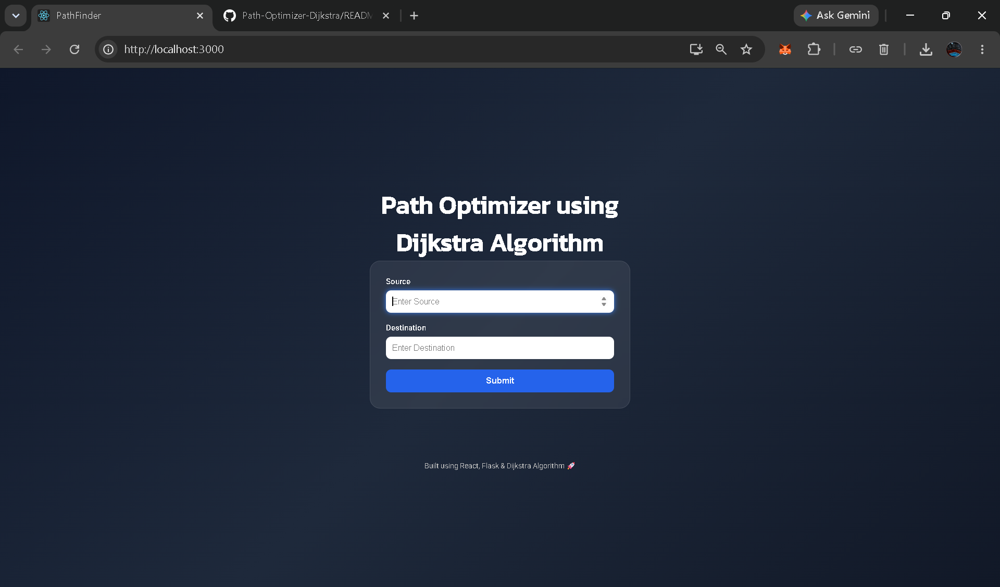
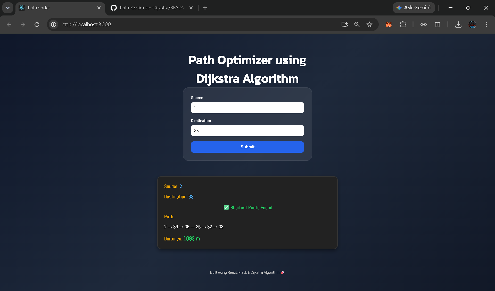

# 🚀 Path Optimizer using Dijkstra Algorithm

A full-stack web application that calculates the shortest path between two nodes using **Dijkstra's Algorithm**. The application provides an interactive interface where users can enter source and destination nodes and instantly get the optimal route along with the total distance.

## 🌐 Live Demo

**Frontend:** https://path-optimizer-dijkstra.vercel.app

**Backend API:** https://path-optimizer-dijkstra.onrender.com

---

## ✨ Features

* Shortest Path Calculation using Dijkstra's Algorithm
* Distance Optimization between nodes
* Interactive React-based User Interface
* Flask REST API Backend
* Real-Time Route Generation
* Input Validation and Error Handling
* Responsive and Modern UI Design
* Deployed on Vercel and Render

---

## 🛠️ Tech Stack

### Frontend

* React.js
* CSS3
* JavaScript (ES6)

### Backend

* Flask
* Flask-CORS
* Python

### Algorithm

* Dijkstra's Algorithm
* Min Heap / Priority Queue

---

## 📂 Project Structure

```bash
PathOptimizer/
│
├── public/
├── src/
│   ├── App.js
│   ├── routes.js
│   ├── App.css
│   └── routes.css
│
├── server.py
├── package.json
├── requirements.txt
└── README.md
```

---

## ⚙️ Installation & Setup

### Clone Repository

```bash
git clone https://github.com/Sunil-705/Path-Optimizer-Dijkstra.git
cd Path-Optimizer-Dijkstra
```

### Frontend Setup

```bash
npm install
npm start
```

### Backend Setup

```bash
pip install -r requirements.txt
python server.py
```

---

## 🎯 How It Works

1. User enters Source and Destination nodes.
2. React frontend sends a request to the Flask backend.
3. Backend executes Dijkstra's Algorithm on the graph.
4. The shortest route and total distance are calculated.
5. Results are displayed instantly on the frontend.

---

## 📸 Screenshots

### Home Page



### Route Calculation



---

## 📈 Future Enhancements

* Interactive Graph Visualization
* Map-Based Route Display
* Dynamic Node Management
* Route History Tracking
* Advanced Pathfinding Algorithms (A*, Bellman-Ford)

---

## 👨‍💻 Author

**Sunil Kumar**

Computer Science Engineering Student

Focused on Web Development, Data Structures & Algorithms, and Full-Stack Development.

GitHub: https://github.com/Sunil-705

---

## ⭐ Support

If you found this project useful, consider giving it a star on GitHub.
